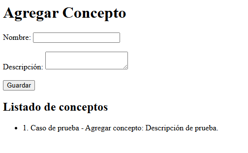
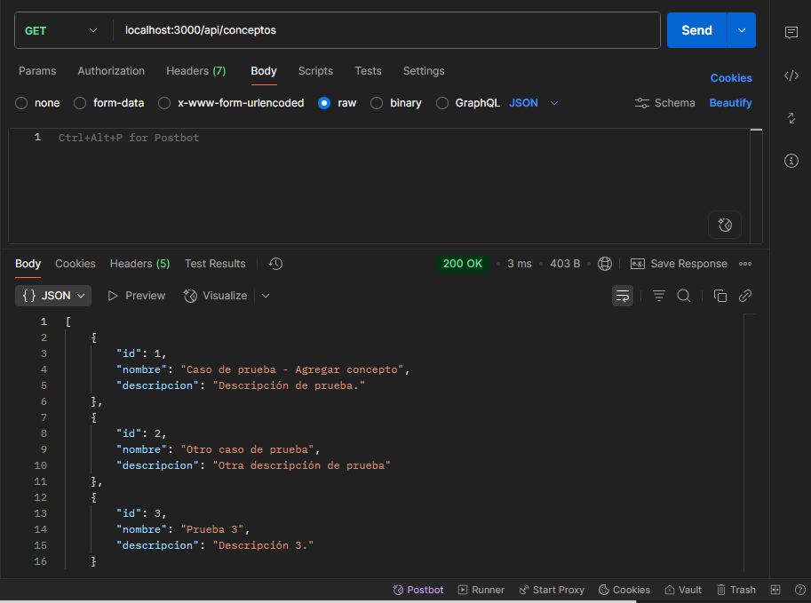
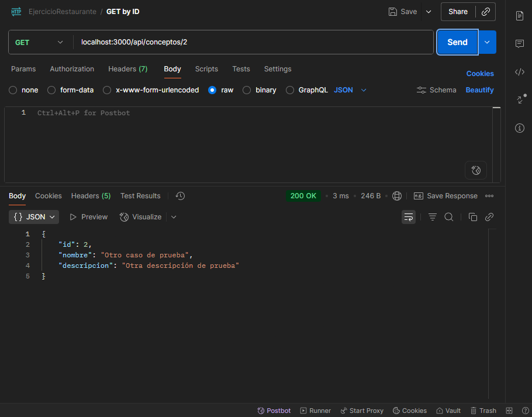
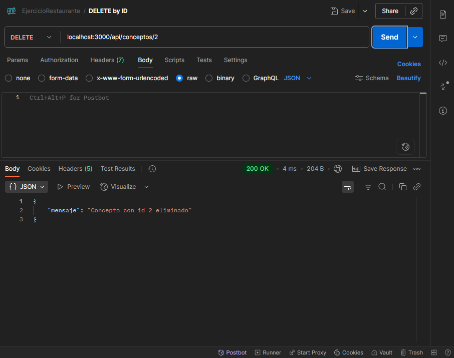
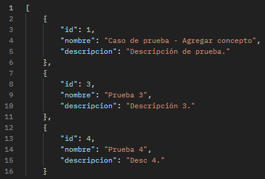
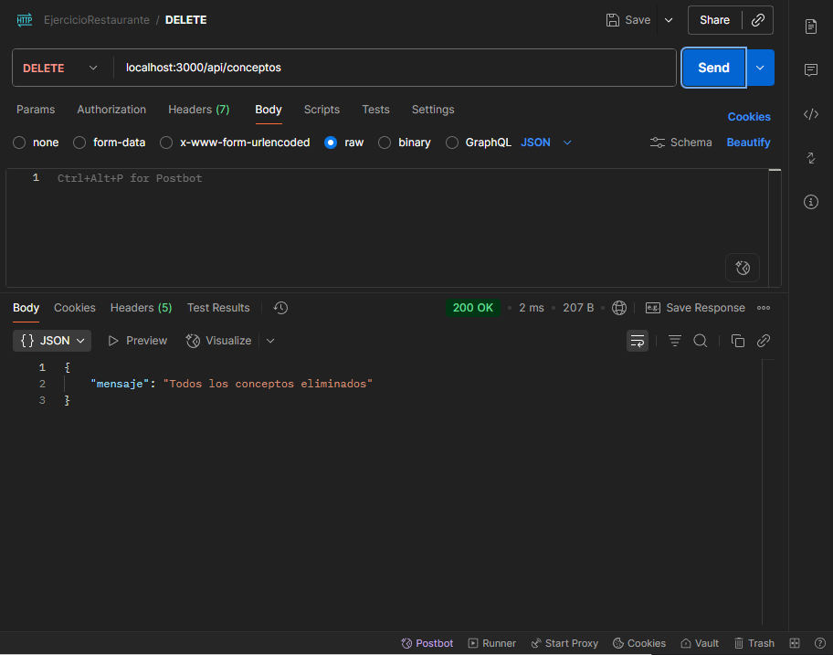
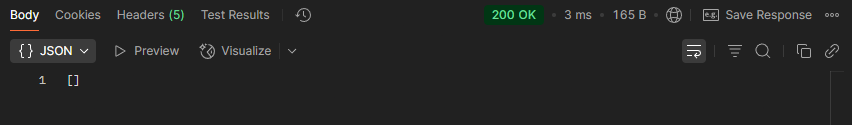

Trabajo Práctico N°1 – Taller de Programación 2
Alumno: Facundo Cedolini
Materia: Taller de Programación 2
Profesor: Franco Borsani

El objetivo de este trabajo es poner en práctica la teoría de las primeras clases de Taller de Programación 2.

Funcionalidades:

Se pide ingresar mediante un formulario nombres de
conceptos vistos en la materia, junto a otro campo de texto para desarrollarlos. Esta
información se guardará en arreglos y deberá poder visualizarse en una vista. Debe
existir una interfaz del sistema estilada (con CSS).
Por otra parte, el servidor deberá poder procesar las siguientes solicitudes
REST en formato JSON:
• GET: obtener listado de todos los conceptos.
• GET/id: obtener información de un concepto en particular.
• DELETE: eliminar todos los conceptos creados.
• DELETE/id: eliminar un concepto en particular.

Casos de prueba:

Caso 1 - Agregar un registro.

Completar el formulario y cliquear en 'Guardar'

Se actualiza la página mostrando el nuevo registro.

Caso 2 - Mostrar todos los registros guardados.

Desde postman enviar un GET a ".../api/conceptos"
Debe mostrar todos los registros.

Caso 3 - Mostrar un registro por id.
Desde postman enviar un GET a ".../api/conceptos/{id}"
Debe mostrar el registro buscado.

Caso 4 - Eliminar un registro por id.
Desde postman enviar un DELETE a ".../api/conceptos/{id}
Debe mostrar confirmación de la eliminación del registro.

Caso 5 - Eliminar todos los registros.
Desde postman enviar un DELETE a ".../api/conceptos
Debe mostrar confirmación de la eliminación de todos los registros.

