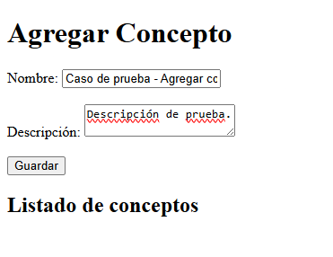

# 📘 Trabajo Práctico N°1 – Taller de Programación 2

**Alumno:** Facundo Cedolini  
**Materia:** Taller de Programación 2  
**Profesor:** Franco Borsani  

---

## 🎯 Objetivo
El objetivo de este trabajo es poner en práctica la teoría de las primeras clases de **Taller de Programación 2**.

---

## ⚙️ Funcionalidades

La aplicación permite:

- Ingresar mediante un formulario **nombres de conceptos** vistos en la materia, junto a otro campo de texto para desarrollarlos.  
- Guardar esta información en **arreglos en memoria** y visualizarla en una vista con **estilos en CSS**.  
- Procesar solicitudes **REST en formato JSON**:

  - `GET /api/conceptos` → obtener listado de todos los conceptos.  
  - `GET /api/conceptos/{id}` → obtener información de un concepto en particular.  
  - `DELETE /api/conceptos` → eliminar todos los conceptos creados.  
  - `DELETE /api/conceptos/{id}` → eliminar un concepto en particular.  

---

## 🧪 Casos de prueba

### ✅ Caso 1 - Agregar un registro
Completar el formulario y cliquear en **Guardar**.

Se actualiza la página mostrando el nuevo registro:

---

### ✅ Caso 2 - Mostrar todos los registros guardados
Desde Postman enviar un `GET` a:

.../api/conceptos

Debe mostrar todos los registros.

---

### ✅ Caso 3 - Mostrar un registro por id
Desde Postman enviar un `GET` a:

.../api/conceptos/{id}

Debe mostrar el registro buscado.

---

### ✅ Caso 4 - Eliminar un registro por id
Desde Postman enviar un `DELETE` a:

.../api/conceptos/{id}

Debe mostrar confirmación de la eliminación del registro:

---

### ✅ Caso 5 - Eliminar todos los registros
Desde Postman enviar un `DELETE` a:

.../api/conceptos

Debe mostrar confirmación de la eliminación de todos los registros:

---

## 📝 Conclusiones

Este trabajo práctico ayudó a:

- **Comprender mejor el flujo cliente-servidor en Node.js**: cómo se procesan las solicitudes y respuestas, cómo distinguir entre los métodos (`GET`, `POST`, `DELETE`) y cómo manejar datos en memoria para simular persistencia.  
- **Relacionar teoría y práctica**: integrando conceptos vistos en clase con un caso aplicado.  
- **Reforzar la lógica frontend-backend**: practicar con HTML, CSS y el servidor.  

La principal dificultad fue integrar todas las partes (**HTML, CSS, servidor y API REST**). Sin embargo, resolviendo cada problema paso a paso, se logró completar el trabajo de manera satisfactoria.
